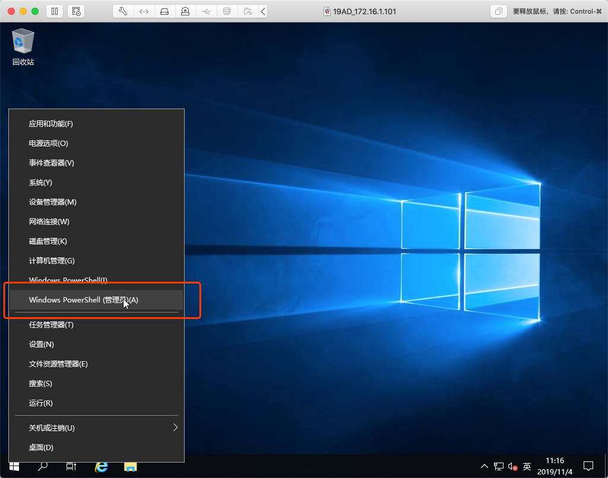

## 01.SSHServer

### 1. 安装SSHServer

> Windows 2019自带OpenSSH安装包



````
-----查看当前OpenSSH安装包状态-------------------------
PS C:\Users\Administrator> Get-WindowsCapability -Online | ? Name -like 'OpenSSH*' 

Name  : OpenSSH.Client~~~~0.0.1.0
State : Installed

Name  : OpenSSH.Server~~~~0.0.1.0
State : NotPresent
-----安装OpenSSH-------------------------
PS C:\Users\Administrator> Add-WindowsCapability -Online -Name OpenSSH.Server~~~~0.0.1.0 

Path          :
Online        : True
RestartNeeded : False
-----验证安装-------------------------
PS C:\Users\Administrator> Get-WindowsCapability -Online | ? name -like 'OpenSSH*'


Name  : OpenSSH.Client~~~~0.0.1.0
State : Installed

Name  : OpenSSH.Server~~~~0.0.1.0
State : Installed
````

### 2. 开启服务
````
PS C:\Users\Administrator> Start-Service -Name "sshd"
PS C:\Users\Administrator> Set-Service -Name "sshd" -StartupType Automatic 
PS C:\Users\Administrator> Set-Service -Name ssh-agent -StartupType Automatic 
-----验证-------------------------
PS C:\Users\Administrator> Get-Service -Name "ssh*"

Status   Name               DisplayName
------   ----               -----------
Running  ssh-agent          OpenSSH Authentication Agent
Running  sshd               OpenSSH SSH Server


PS C:\Users\Administrator> Get-Service -Name "sshd" | Select-Object *


Name                : sshd
RequiredServices    : {}
CanPauseAndContinue : False
CanShutdown         : False
CanStop             : True
DisplayName         : OpenSSH SSH Server
DependentServices   : {}
MachineName         : .
ServiceName         : sshd
ServicesDependedOn  : {}
ServiceHandle       : SafeServiceHandle
Status              : Running
ServiceType         : Win32OwnProcess
StartType           : Automatic
Site                :
Container           :
````

### 3. 登录使用'PowerShell'
````
PS C:\Users\Administrator> New-ItemProperty -Path "HKLM:\SOFTWARE\OpenSSH" -Name DefaultShell -Value "C:\Windows\System32\WindowsPowerShell\v1.0\powershell.exe" -PropertyType String -Force


DefaultShell : C:\Windows\System32\WindowsPowerShell\v1.0\powershell.exe
PSPath       : Microsoft.PowerShell.Core\Registry::HKEY_LOCAL_MACHINE\SOFTWARE\OpenSSH
PSParentPath : Microsoft.PowerShell.Core\Registry::HKEY_LOCAL_MACHINE\SOFTWARE
PSChildName  : OpenSSH
PSDrive      : HKLM
PSProvider   : Microsoft.PowerShell.Core\Registry
````