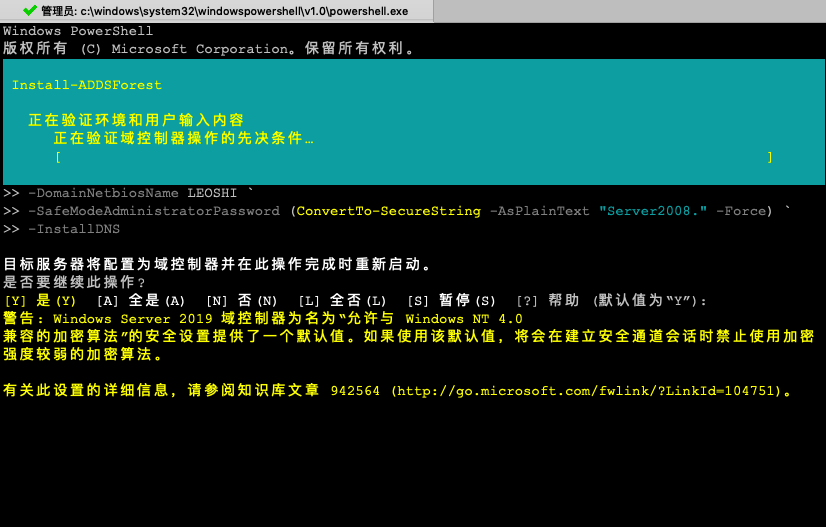

## 05.ActiveDirectory Install

### 1. PowerShell
````
PS C:\Users\Administrator> Install-WindowsFeature -name AD-Domain-Services -IncludeManagementTools 
Success Restart Needed Exit Code      Feature Result                                
------- -------------- ---------      --------------
True    No             Success        {Active Directory 域服务, 组策略管理, Active Direc... 

````

### 2. Reboot Server
````
PS C:\Users\Administrator> Restart-Computer -Force 
````

### 3. Config Server
````
PS C:\Users\Administrator> Install-ADDSForest `
-DomainName "leoshi.tech" `
-ForestMode WinThreshold `
-DomainMode WinThreshold `
-DomainNetbiosName LEOSHI `
-SafeModeAdministratorPassword (ConvertTo-SecureString -AsPlainText "Server2008." -Force) `
-InstallDNS 
````



## END